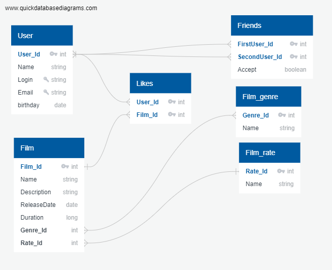

# java-filmorate
Template repository for Filmorate project.

Связи между таблицами:  
User - Likes One-To-Many  
Film - Likes One-To-Many  
User - Friends Many-To-Many  
Film - Film_genre Many-To-Many  
Film_rate - Film One-To-Many  

Уникальная комбинация полей:  
В таблице Friends комбинация полей (FirstUser_Id , SecondUser_Id) уникальная,   
исключает повторы, пользователи считаются друзьями, если поле Accept = 'True'  
в коде планируется делать проверку, чтобы первым (FirstUser_Id) шел id   
с меньшим значением  

Примеры запросов:  
//findAll() - получение всех фильмов  
SELECT *  
FROM Film  
  
//findFilm(@PathVariable("filmId") Integer filmId) - поиск фильма по Id  
SELECT *  
FROM Film  
WHERE Film.Film_Id = filmId  
  
//deleteFilm(@PathVariable("filmId") Integer filmId) - удаление фильма по Id  
DELETE  
FROM Film  
WHERE Film.Film_Id = filmId  
  
//post(@Valid @RequestBody Film film) - добавление фильма  
INSERT  
INTO Film (Name, Description, ReleaseDate, Duration, Genre_Id, Rate_Id)  
VALUES ('Test', 'Test', '2022-01-01', 1000, 2, 1)  
  
//addLike(@PathVariable("id") Integer id, @PathVariable("userId") Integer userId)   
- добавить лайк фильму  
  
INSERT  
INTO Likes (User_Id, Film_Id)  
VALUES (10, 3)  
  
//removeLike(@PathVariable("id") Integer id, @PathVariable("userId") Integer userId)   
- удалить лайк фильму  
  
DELETE  
FROM Likes  
WHERE Likes.Film_id = id AND Likes.User_id = userId  
  
//getFilmsByLikes(@RequestParam(value = "count", defaultValue = "10",  
required = false) Integer count) - получить первые 10 фильмов по числу лайков  
SELECT *, COUNT(l.User_Id) AS likes_count  
FROM Film AS f  
LEFT JOIN Likes AS l ON f.Film_id = l.Film_id  
GROUP BY f.Film_id  
ORDER BY likes_count DESC  
LIMIT 10  
  
//getFilmsByGenre - получить фильмы определенного жанра genre_Id  
SELECT *  
FROM Film AS f  
WHERE f.Genre_Id = genre_Id  
  
//groupFilmsByGenre - получить группировку фильмов по жанрам  
SELECT fg.Name,  
COUNT(f.film_Id)  
FROM Film AS f  
LEFT JOIN Film_genre AS fg ON f.Genre_Id = fg.Genre_id  
GROUP BY fg.Name  
  
//groupFilmsByRate - получить группировку фильмов по возрастному рейтингу  
SELECT fr.Name,  
COUNT(f.film_Id)  
FROM Film AS f  
LEFT JOIN Film_rate AS fr ON f.Rate_Id = fr.Rate_id  
GROUP BY fr.Name  
  
//getFilmsByRate - получить фильмы определенного возрастного рейтинга rate_Id  
SELECT *  
FROM Film AS f  
WHERE f.Rate_Id = rate_Id  
  
//Запросы на добавление, удаление, получение User аналогичны запросам для Film  
  
//addFriend(@PathVariable("id") Integer id, @PathVariable("friendId") Integer friendId)   
- добавить пользователя в друзья  
  
INSERT  
INTO Friends (FirstUser_Id, SecondUser_Id, Accept)  
VALUES (id, friendId, true)  
  
//removeFriend(@PathVariable("id") Integer id, @PathVariable("friendId") Integer friendId)  
DELETE  
FROM Friends  
WHERE (Friends.FirstUser_id = id OR Friends.SecondUser_id = id)   
AND (Friends.FirstUser_id = friendId OR Friends.SecondUser_id = friendId)   
AND (Accept = True)  
  
//getUserFriends(@PathVariable("id") Integer id) - получить список друзей пользователя id  
SELECT u.*  
FROM (SELECT first_Id  
FROM (SELECT *  
FROM filmorate.friends AS fr  
WHERE (fr.FirstUser_Id = id OR fr.SecondUser_Id = id) AND fr.accept = true) AS tab  
WHERE SecondUser_Id = id  
UNION  
SELECT secondUser_Id  
FROM (SELECT *  
FROM filmorate.friends  
WHERE (FirstUser_Id = id OR SecondUser_Id = id) AND fr.accept = true) AS tab  
WHERE FirstUser_Id = id) AS user_friends  
LEFT JOIN filmorate.user AS u ON u.user_Id = user_friends.firstUser_Id  
  
//getMatchingFriends(@PathVariable("id") Integer id,   
@PathVariable("otherId") Integer otherId) -   
получить список общих друзей пользователей id и otherId  
  
SELECT u.*  
FROM  
(SELECT firstUserSearch.first_id  
FROM (SELECT FirstUser_Id  
FROM (SELECT *  
FROM filmorate.friends AS fr  
WHERE (fr.FirstUser_Id = id OR fr.SecondUser_Id = id) AND fr.accept = true) AS tab  
WHERE SecondUser_Id = id  
UNION  
SELECT secondUser_Id  
FROM (SELECT *  
FROM filmorate.friends  
WHERE (FirstUser_Id = id OR SecondUser_Id = id) AND accept = true) AS tab  
WHERE FirstUser_Id = id) AS firstUserSearch  
JOIN (SELECT first_Id  
FROM (SELECT *  
FROM filmorate.friends AS fr  
WHERE (fr.FirstUser_Id = otherId OR fr.SecondUser_Id = otherId) AND fr.accept = true)   
AS tab  
WHERE SecondUser_Id = otherId  
UNION  
SELECT secondUser_Id  
FROM (SELECT *  
FROM filmorate.friends  
WHERE (FirstUser_Id = otherId OR SecondUser_Id = otherId) AND accept = true) AS tab  
WHERE FirstUser_Id = otherId) AS secondUserSearch   
ON firstUserSearch.first_id = secondUserSearch.first_id) AS matching  
LEFT JOIN filmorate.user AS u ON u.user_Id = matching.first_Id  

