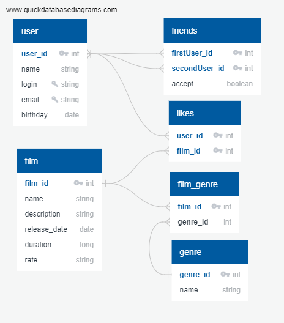

# java-filmorate
Filmorate project.

Связи между таблицами:  
user - likes One-To-Many  
film - likes One-To-Many  
user - friends Many-To-Many  
film - film_genre One-To-Many

Уникальная комбинация полей:  
В таблице Friends комбинация полей (FirstUser_Id , SecondUser_Id) уникальная,   
исключает повторы, пользователи считаются друзьями, если поле Accept = 'True'  
в коде планируется делать проверку, чтобы первым (FirstUser_Id) шел id    
с меньшим значением

Поля Genre И Rate:
имеют тип VARCHAR, при создании таблицы будут объявлена как ENUM

Примеры запросов:  
//findAll() - получение всех фильмов  
SELECT *
FROM film

//findFilm(@PathVariable("filmId") Integer filmId) - поиск фильма по Id  
SELECT *
FROM film  
WHERE film.film_id = filmId

//deleteFilm(@PathVariable("filmId") Integer filmId) - удаление фильма по Id  
DELETE  
FROM Film  
WHERE film.film_id = filmId

//post(@Valid @RequestBody Film film) - добавление фильма  
INSERT  
INTO film (name, description, release_Date, duration, genre, rate)  
VALUES ('Test', 'Test', '2022-01-01', 1000, 2, 1)

//addLike(@PathVariable("id") Integer id, @PathVariable("userId") Integer userId)  
добавить лайк фильму

INSERT  
INTO likes (user_id, film_id)  
VALUES (10, 3)

//removeLike(@PathVariable("id") Integer id, @PathVariable("userId") Integer userId)  
удалить лайк фильму

DELETE  
FROM likes  
WHERE likes.film_id = id AND likes.user_id = userId

//getFilmsByLikes(@RequestParam(value = "count", defaultValue = "10",  
required = false) Integer count) - получить первые 10 фильмов по числу лайков  
SELECT *, COUNT(l.user_id) AS likes_count  
FROM film AS f  
LEFT JOIN Likes AS l ON f.film_id = l.film_id  
GROUP BY f.film_id  
ORDER BY likes_count DESC  
LIMIT 10

//getFilmsByGenre - получить фильмы определенного жанра genre_Id  
SELECT *
FROM film AS f  
WHERE f.genre_id = genre_Id

//groupFilmsByGenre - получить группировку фильмов по жанрам  
SELECT fg.Name,  
COUNT(f.film_id)  
FROM Film AS f  
LEFT JOIN film_genre AS fg ON f.genre_Id = fg.genre_id  
GROUP BY fg.name

//Запросы на добавление, удаление, получение User аналогичны запросам для Film

//addFriend(@PathVariable("id") Integer id, @PathVariable("friendId") Integer friendId)  
добавить пользователя в друзья

INSERT  
INTO friends (firstUser_id, secondUser_id, accept)  
VALUES (id, friendId, true)

//removeFriend(@PathVariable("id") Integer id, @PathVariable("friendId") Integer friendId)  
DELETE  
FROM friends  
WHERE (friends.firstUser_id = id OR friends.secondUser_id = id)   
AND (friends.firstUser_id = friendId OR friends.secondUser_id = friendId)   
AND (accept = True)

//getUserFriends(@PathVariable("id") Integer id) - получить список друзей пользователя id  
SELECT u.*  
FROM (SELECT first_id  
FROM (SELECT *
FROM filmorate.friends AS fr  
WHERE (fr.firstUser_id = id OR fr.secondUser_id = id) AND fr.accept = true) AS tab  
WHERE secondUser_id = id  
UNION  
SELECT secondUser_id  
FROM (SELECT *
FROM filmorate.friends  
WHERE (firstUser_id = id OR secondUser_id = id) AND fr.accept = true) AS tab  
WHERE firstUser_id = id) AS user_friends  
LEFT JOIN filmorate.user AS u ON u.user_id = user_friends.firstUser_id

//getMatchingFriends(@PathVariable("id") Integer id,   
@PathVariable("otherId") Integer otherId) -   
получить список общих друзей пользователей id и otherId

SELECT u.*  
FROM  
(SELECT firstUserSearch.first_id  
FROM (SELECT firstUser_id  
FROM (SELECT *
FROM filmorate.friends AS fr  
WHERE (fr.firstUser_id = id OR fr.secondUser_id = id) AND fr.accept = true) AS tab  
WHERE secondUser_id = id  
UNION  
SELECT secondUser_Id  
FROM (SELECT *
FROM filmorate.friends  
WHERE (firstUser_id = id OR secondUser_id = id) AND accept = true) AS tab  
WHERE firstUser_id = id) AS firstUserSearch  
JOIN (SELECT first_id  
FROM (SELECT *
FROM filmorate.friends AS fr  
WHERE (fr.firstUser_id = otherId OR fr.secondUser_id = otherId) AND fr.accept = true)   
AS tab  
WHERE secondUser_id = otherId  
UNION  
SELECT secondUser_id  
FROM (SELECT *
FROM filmorate.friends  
WHERE (firstUser_id = otherId OR secondUser_id = otherId) AND accept = true) AS tab  
WHERE firstUser_id = otherId) AS secondUserSearch   
ON firstUserSearch.first_id = secondUserSearch.first_id) AS matching  
LEFT JOIN filmorate.user AS u ON u.user_id = matching.first_id  

